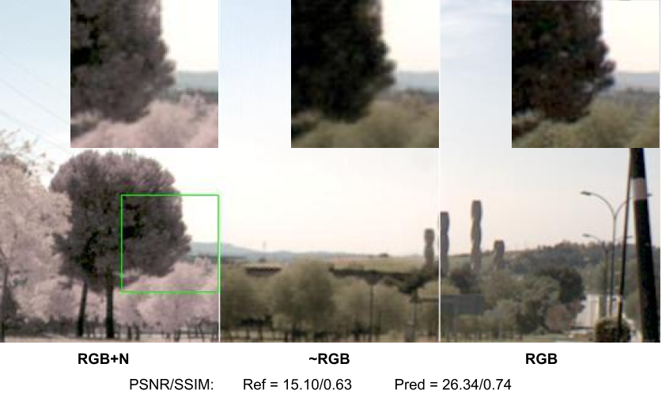
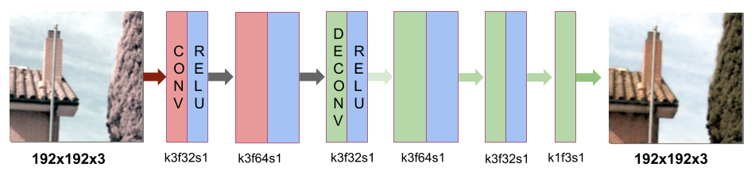
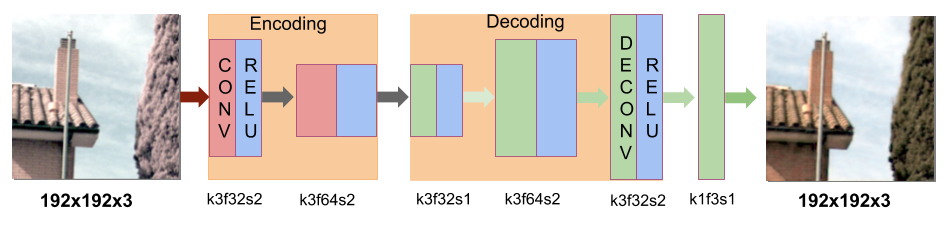

# CDNet and ENDENet
```diff
- We are updating the repo, just give us a couple of days :)
```

A python implemenation of [Wide-Band Color Imagery Restoration for RGB-NIR Single Sensor Images](http://www.mdpi.com/1424-8220/18/7/2059)
using Tensorflow.

<div align='center'>

</div>

Multi-spectral RGB-NIR sensors have become ubiquitous in recent years.
 These sensors allow the visible and near-infrared spectral bands of a
  given scene to be captured at the same time. With such cameras, the 
  acquired imagery has a compromised RGB color representation due to 
  near-infrared bands (700–1100 nm) cross-talking with the visible bands 
  (400–700 nm). This paper proposes two deep learning-based architectures 
  to recover the full RGB color images, thus removing the NIR information 
  from the visible bands. The proposed approaches directly restore the 
  high-resolution RGB image by means of convolutional neural networks. 
  They are evaluated with several outdoor images; both architectures reach 
  a similar performance when evaluated in different scenarios and using 
  different similarity metrics. The dataset used for the training and testing
  is OMSIV from [SSMID](https://xavysp.github.io/post/ssmid/).


## Models

Two different CNN-based architectures are proposed.
 The first one consists of a Convolutional and 
 Deconvolutional Neural Network (CDNet) that is 
 formed by two and four hidden layers, respectively
  (see Figs. below).
  the output layer gives a predicted image 
  ~RGB supervised by the ground truth image (RGB), 
  in summary, ~RGB= CDNet(RGB+N,RGB), where 
  RGB+N is a color image corrumpted by NIR information
  because of cross-talking.
  
  ENDENet (second row in the Fig. below), has the same characteristics
  and parameters, the difference is the encoding and decoding
  process in the convolution and deconvolutional stage.
  
  <div align='center'>


</div>

## Setup

All code was developed and tested on Ubuntu 16.04 with Python 3.5 and Tensorflow 1.8

Before running the code, you need to download 

**(old)**
the [dataset for training](https://drive.google.com/open?id=1bNYC4NF3uJa9Sig5VCpDYx3pLKcZCYbm)
 and [dataset for testing](https://drive.google.com/open?id=1otfV1gg7NdqesJnpmBPvNBrcFRFJKi7s).

**(updated)**
Please, before download the OMSIV dataset visit this [page](https://xavysp.github.io/ssmid-dataset)

#### Dataset managing
Once your dataset is downloaded please go to train.py

https://github.com/xavysp/color_restorer/blob/c9462606e21ba950c5baa01f663cf63923282e16/train.py#L45-L49

 tf.app.flags.DEFINE_bool('use_base_dir', False, """True when you are going to put the base directory of OMSIV dataset""")
 if FLAGS.use_base_bir:
     tf.app.flags.DEFINE_string('dataset_dir', 'put your base dataset directory', """example:dataset""")
 else:
 tf.app.flags.DEFINE_string('dataset_dir', '/opt/dataset', """The default path to the patches dataset""")


## Requirements

Python 3

Tensorflow  1.2 or higher

Numpy

Matplotlib

## Citation

If you use this code for your research, please cite our papers.

    Dataset:
     
    
    @INPROCEEDINGS{8310105,
    author={X. Soria and A. D. Sappa and A. Akbarinia},
    booktitle={2017 Seventh International Conference on Image Processing Theory, Tools and Applications (IPTA)},
    title={Multispectral single-sensor RGB-NIR imaging: New challenges and opportunities},
    year={2017},
    pages={1-6},
    keywords={cameras;computer vision;hyperspectral imaging;image colour analysis;image resolution;image restoration;image sensors;infrared imaging;neural nets;;RGBN outdoor dataset;color distortion;color restoration;multispectral single-sensor RGB-NIR imaging;near infrared spectral bands;single sensor multispectral images;specular materials;visible spectral bands;Image color analysis;Image restoration;Sensitivity;Vegetation mapping;Color restoration;Multispectral images;Neural networks;RGB-NIR dataset;Single-sensor cameras},
    doi={10.1109/IPTA.2017.8310105},
    ISSN={2154-512X},
    month={Nov},}
     
    Restoration approach:
     
    @article{soria2018rgbn_restorer,
      title={Wide-Band Color Imagery Restoration for RGB-NIR Single Sensor Images.},
      author={Soria, X and Sappa, AD and Hammoud, RI},
      journal={Sensors (Basel, Switzerland)},
      volume={18},
      number={7},
      pages={2059},
      doi={10.3390/s18072059},
      ISSN={1424-8220},
      year={2018}}
        
    

